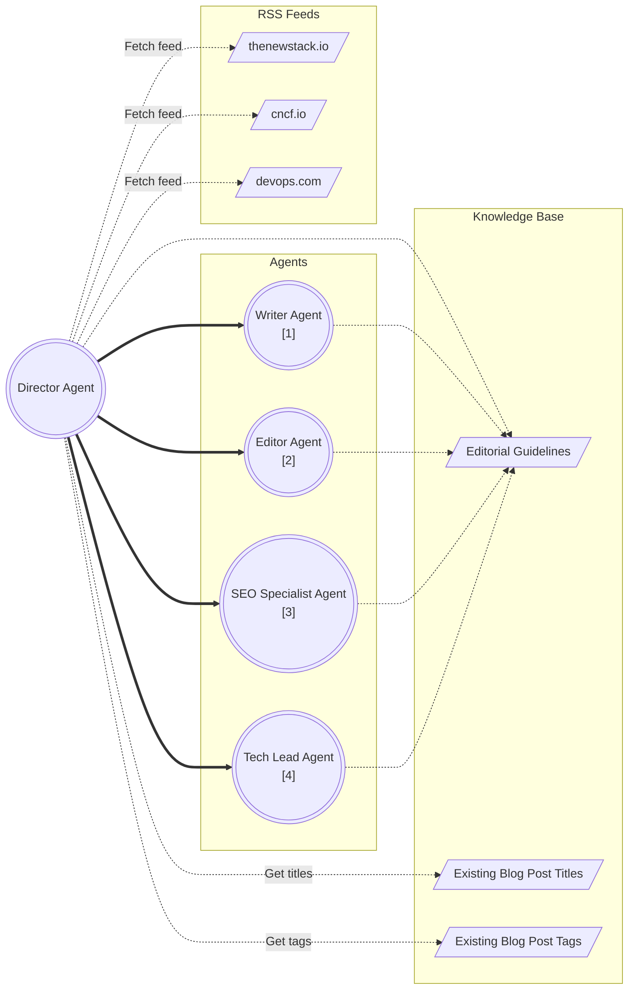
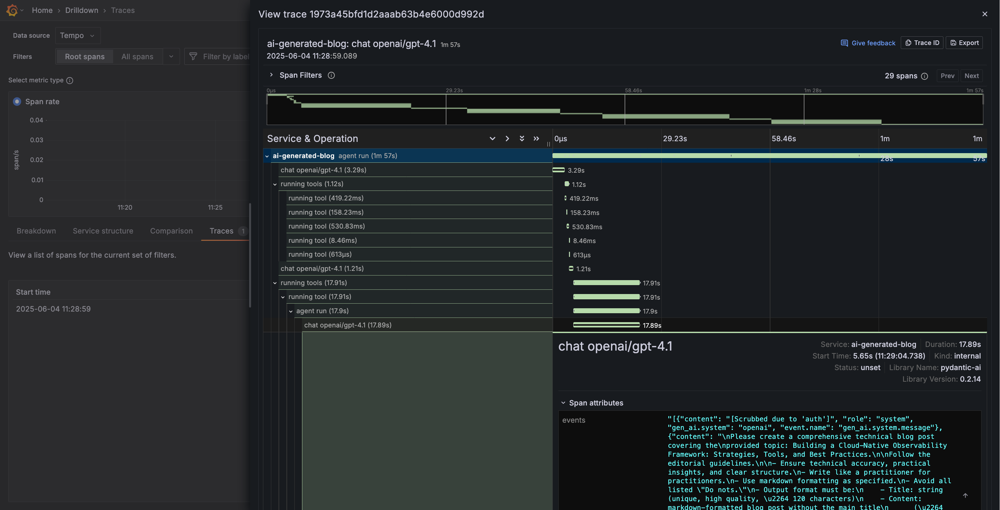

# AI generated blog

[](https://app.netlify.com/sites/ai-generated-tech-blog/deploys)

This repository demonstrate how to use [Pydantic AI][pydantic-ai] with
[Hugo][hugo] to generate blog posts on a given topic using different models
(OpenAI GPT 4o, GPT 4.1, o3, Google Gemini 2.5, xAI Grok 2, Grok 3, etc).

> [!WARNING]
>  This project is not intended to flood the web with low-quality AI-generated
>  content. The goal is to explore and demonstrate how different AI models can
>  assist in generating blog posts. Use this responsibly and with a focus on
>  transparency, originality, and value.

## Overview

The diagram below outlines the end-to-end workflow for generating blog posts.



## Generating blog posts

To generate a new blog post, choose a model and execute the commands below from
the `./ai/` directory.

Tracing is handled by [logfire][logfire] using [Grafana][grafana],
[Tempo][tempo], [Prometheus][prometheus].

Prior to generating posts, deploy the observability stack using [Podman
Compose][podman-compose] (alternatively, use [Docker Compose][docker-compose]):

```bash
# to start the observability stack
podman compose up -d ./ai/observability/

# generate a post
export OPENAI_API_KEY=your-api-key
export MODEL=openai:gpt-4.1
pip install -r requirements.txt
python main.py

# stop the observability stack when you are done
podman compose down -v ./ai/observability/
```

Use Grafana to see the Traces at http://localhost:3000:



### Models

Refer to the [Pydantic AI models documentation][pydantic-models] for
instructions to use other models.

#### OpenAI

```bash
export OPENAI_API_KEY=your-api-key
export MODEL=openai:gpt-4.1

python main.py
```

#### Google Gemini

```bash
# login using GCloud CLI
gcloud auth application-default login

export GOOGLE_CLOUD_PROJECT=my-project
export MODEL=google-vertex:gemini-2.5-pro-preview-03-25

python main.py
```

#### xAI Grok

```bash
export MODEL=openai:grok-3-mini-beta
export OPENAI_API_KEY=your-grok-api-key
export OPENAI_BASE_URL=https://api.x.ai/v1

python main.py
```

#### DeepSeek

```bash
export MODEL=openai:deepseek-chat
export OPENAI_API_KEY=your-deepseek-api-key
export OPENAI_BASE_URL=https://api.deepseek.com/v1

python main.py
```

#### OpenRouter

```bash
export MODEL=openrouter:meta-llama/llama-4-maverick
export OPENAI_API_KEY=your-openrouter-api-key
export OPENAI_BASE_URL=https://openrouter.ai/api/v1

python main.py
```

## Running Hugo

```bash
hugo server
``````

Access the website locally at http://localhost:1313.

<!-- links -->
[docker-compose]: https://docs.docker.com/compose/
[grafana]: https://grafana.com
[hugo]: https://gohugo.io
[logfire]: https://pydantic.dev/logfire
[podman-compose]: https://github.com/containers/podman-compose
[prometheus]: https://prometheus.io/
[pydantic-ai]: https://ai.pydantic.dev
[pydantic-models]: https://ai.pydantic.dev/models/
[tempo]: https://grafana.com/docs/tempo/latest/
