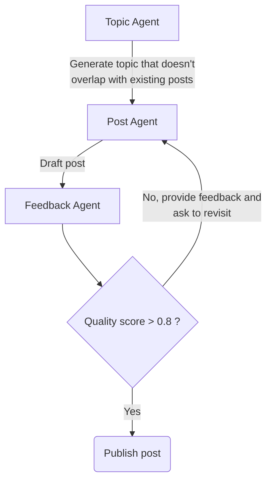

# AI generated blog

[](https://app.netlify.com/sites/ai-generated-tech-blog/deploys)

This repository demonstrate the use of [Pydantic AI](https://ai.pydantic.dev)
together with [Hugo](https://gohugo.io/) to generate blog posts on a given
topic using various models (OpenAI ChatGPT 4o, Gemini).

> [!WARNING]
>  This project is not intended to flood the web with low-quality AI-generated
>  content. The goal is to explore and demonstrate how different AI models can
>  assist in generating blog posts. Use this responsibly and with a focus on
>  transparency, originality, and value.



## Generating blog posts

```bash
cd ai/
# if using OpenAI, refer to the pydantic ai documentation for other models
export OPENAI_API_KEY=your-api-key
export MODEL=openai:gpt-4.1
python main.py
```

## Running Hugo

```bash
hugo server
``````

Access the website locally at http://localhost:1313.
