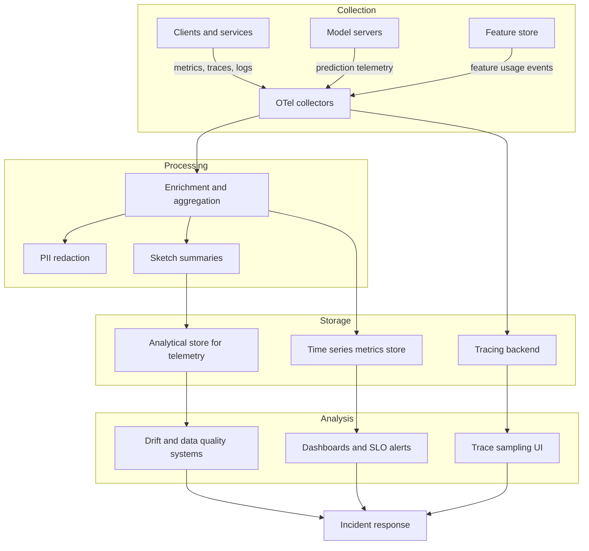

+++
date = '2025-08-11T18:47:17.087282+00:00'
title = 'Designing observability for distributed ML systems: practical patterns'
summary = 'Patterns and trade-offs for observability in distributed ML: signals, pipelines, feature and model telemetry, tracing, alerting, and privacy controls to detect drift and reduce time to resolution.'
draft = 'false'
model = 'gpt-5-mini'
tags = ["observability", "ml", "model-monitoring"]
+++

## Introduction

Distributed machine learning systems include training pipelines, feature
stores, model serving, and user-facing services. You need observability that
covers infrastructure signals and ML-specific telemetry. This post gives
practical patterns and trade-offs you can apply to get meaningful coverage
across the ML lifecycle.

## The problem and approach

Models fail in production for reasons standard infrastructure monitoring does
not capture. You need to detect data drift, model regressions, skew between
training and production data, inference performance issues, and pipeline
failures.

Treat observability as a layered system of signals and pipelines. Combine
infrastructure metrics, traces, structured logs, model telemetry, and data
quality signals. Use correlation keys and model metadata to link signals
across training, feature serving, and inference. Apply collection, processing,
storage, and alerting patterns that scale with cardinality and privacy
constraints.

## Observability goals for distributed ML

- Detect inference latency and throughput regressions.
- Detect model quality degradation measured by business metrics or proxies.
- Detect data problems: drift, schema changes, missing features, and label
  shift.
- Provide explainability signals to speed root cause analysis.
- Provide cost and resource visibility for ML infrastructure.
- Preserve privacy and compliance when telemetry touches personally
  identifiable information (PII).

## Signals and what they buy you

### Metrics

Low-cost, high-cardinality operational signals. Use metrics for latency
service level objectives (SLOs), resource usage, request rates, and counts
of failure types. For high-cardinality ML attributes, plan a separate metrics
pipeline with early aggregation and rollups.

### Traces

Distributed traces link calls across feature stores, model backends, and
downstream services. Use traces to surface hot paths and debug tail latency.
Instrument feature lookups, model inference, and retries.

### Structured logs

Use logs for rich context that does not fit metrics or traces. Correlate logs
to traces with request ids. Logs are searchable and useful for audit trails.
Enforce structured fields and schema validation for log producers.

### Events and dataset lineage

Capture versioned datasets, schema changes, and training runs. Store run ids
and dataset ids alongside model versions. This metadata is critical to explain
why a model changed.

### Model telemetry

Capture predictions, confidence, feature aggregates, and lightweight
explanations. Use sampling and aggregation to avoid leaking PII and to control
costs. Record model id and training dataset id with every telemetry event.

### Patterns for instrumentation and correlation

- Propagate a single correlation id across the request lifecycle. Attach it to
  traces, logs, and metrics. This links an inference request to the dataset
  and the training run for the model.

- Use salted hashes or HMACs for user identifiers rather than raw PII. This
  lets you detect repeated users while reducing reidentification risk. Keep
  salts or keys in a restricted secret store and rotate them on a policy.

- Emit model metadata with each prediction. Include model id, version, and
  training dataset id to make split-by-model analysis straightforward.

- Separate operational metrics and ML quality metrics. Keep high-cardinality
  metrics in a separate pipeline and apply early aggregation to control
  cardinality.

## Observability pipeline architecture

Use a layered pipeline that separates collection, processing, and long-term
analysis. This supports different retention, cost, and query needs.

- Collection layer. Lightweight agents and SDKs capture metrics, traces, and
  logs. Use OpenTelemetry for traces and standard exporters for metrics. Open
  Telemetry provides cross-language instrumentation and a vendor-neutral
  format.

- Processing layer. Apply enrichment, sampling, aggregation, and PII
  redaction. Use a stream processor to compute feature-level aggregates and
  to produce sketch-based summaries for cardinality control. Consider
  deterministic sampling keyed to a stable id so that sampled slices are
  reproducible. For example, sample 1 percent of requests where a hash of
  the correlation id mod 100 equals zero.

- Storage layer. Store operational metrics in a time series system designed
  for your cardinality needs. Store traces in a distributed tracing backend
  that supports service maps and strong sampling. Store model telemetry and
  feature distributions in an analytical store with schema support and good
  columnar scan performance.

- Analysis and alerting. Use dashboards for exploration. Use a separate rules
  engine for SLOs and incident alerts. Use ML-specific alerting for drift
  and data quality anomalies.

Typical deployment diagram

## Practical patterns for ML-specific observability

### Feature-level monitoring

Track feature distributions that matter for the model. You cannot monitor all
features at full cardinality. Choose a small set of critical features to
monitor at higher fidelity. For other features use aggregated statistics and
sketches to track heavy hitters. Use metrics such as percentiles, missing
rate, and population stability index (PSI) or KL divergence to compare
training and production distributions.

#### Why this matters

Feature drift causes silent model degradation. If you only watch final model
performance you may miss upstream data pipeline issues for a long time.

### Model prediction monitoring

Collect prediction summaries such as class distribution, confidence
histograms, and per-segment error proxies. Do this for each deployed model
version. Use shadow traffic to compare candidate models to production in a
controlled way. When labels are delayed, compare prediction distributions and
proxy metrics to detect regression early.

#### Why this matters

Models can drift in output distribution without infrastructure issues. A
comparison of current and historical outputs gives earlier warning than
waiting for labels.

### Data and label lag handling

Labels often arrive with long delays. When labels lag, use proxy metrics and
a clear lineage that records when labels for a prediction are expected. Treat
label arrival as part of the SLI (service level indicator) for model quality.
Monitor label backlog growth and alert when backlog exceeds expected windows.

### Explainability telemetry

Capture lightweight explanation artifacts such as aggregated SHAP summaries
or feature importance sketches rather than full per-request SHAP vectors.
Keep the explanations tied to model version and dataset id. Use them to
detect shifts in feature importance.

#### Why this matters

Changes in feature importance often precede distribution or concept drift. You
can prioritize investigation when a feature suddenly becomes dominant.

## Tracing and latency patterns

Trace across feature lookups, preprocessing, inference, and postprocessing.
Instrument tail latency and p95 and p99 percentiles. Use trace-based
sampling for problematic requests. Capture GPU (graphics processing unit)
utilization and associate it with model versions and node ids.

#### Why this matters

Performance issues often come from feature serving or heavy inputs. A trace
shows where time is spent and where retries or queuing occur.

## Alerting and SLOs for ML systems

Define SLOs for both operational and quality signals. Say SLO and SLI when you
introduce them. Use time windows for alerts to reduce noise.

Examples of SLOs

- Latency. 95th percentile inference latency must be under X ms.
- Availability. Model endpoint success rate must be above Y percent.
- Quality SLI. Rolling AUC (area under the curve) or proxy label accuracy must
  not drop below a threshold relative to baseline.

Set alert thresholds that include time windows and minimum sample sizes so
small transient shifts do not produce noisy alerts. Include runbooks that
reference data checks and model metadata to speed triage.

## Cost and privacy considerations

Telemetry volume grows quickly with model traffic and feature cardinality.
Design for cost by aggregating early and sampling intelligently. Use sketches
such as HyperLogLog to estimate cardinality without storing raw values. Use
digests for accurate percentiles with controlled storage.

Avoid logging raw PII. When you must include user-related signals, use salted
hashes or HMACs and store reidentification keys in a restricted vault for
approved processes. Evaluate regulatory requirements such as GDPR and CCPA
before storing any user-level telemetry.

## Operational pitfalls and how to avoid them

### High cardinality metrics create cost and query performance problems

- Mitigation. Aggregate dimensions early. Limit tag cardinality. Use
  rollups and sketch-based summaries.

### Telemetry overload hides signal

- Mitigation. Define a small set of critical SLIs and dashboards. Route noisy
  or infrequent signals to long-term analytic stores with lower query SLA.

### Sampling bias from selective telemetry

- Mitigation. Use deterministic sampling keyed to the correlation id for
  reproducible slices. Ensure sampled datasets preserve important segments.

### Leaking sensitive data through telemetry

- Mitigation. Apply PII redaction in the processing layer. Enforce privacy
  checks as part of CI for instrumentation changes.

### Practical tool combinations and why they work

- OpenTelemetry for tracing. It provides a vendor-neutral way to collect and
  propagate traces across services and languages.

- Prometheus and long-term compatible backends such as Cortex, Thanos, or
  Mimir for operational metrics. Prometheus is efficient for many time series
  patterns but needs a compatible long-term solution for high retention and
  scale.

- Analytical stores and ML telemetry products. Use a columnar store or an ML
  telemetry product for long-term drift analysis and debugging. Tools such
  as Feast for feature serving and Evidently or WhyLabs for drift and data
  quality integrate well in this layer.

## Real world examples

- Fraud detection at scale. Monitor per-feature distributions for identity
  features and compare candidate models to production on shadow traffic. Set
  alerts on sudden spikes of rare feature combinations that are strongly
  associated with fraud.

- Personalization recommender. Track per-segment CTR proxies and per-model
  version prediction distributions. Use traces to find that latency spikes
  come from slow feature store joins.

- Credit scoring. Keep strict lineage of training data and labels. Apply PII
  controls and maintain an audit trail of every model release and dataset
  version.

## Standards and references

- OpenTelemetry specification, https://opentelemetry.io
- Prometheus documentation, https://prometheus.io
- Sculley et al., Hidden technical debt in machine learning systems, 2015
- Feast feature store, https://feast.dev
- Evidently data and model monitoring, https://docs.evidently.ai
- WhyLabs ML observability platform, https://whylabs.ai

## Summary of outcomes and next steps

### Outcomes you should expect

- Faster root cause for model failures through correlated telemetry.
- Earlier detection of data and concept drift through feature monitoring.
- Lower observation costs by aggregating and sampling strategically.
- Safer telemetry through enforced PII controls.

### Next steps

- Define a minimal set of SLIs for your models and instrument them first.
- Add correlation ids and model metadata to every telemetry event.
- Pilot model-level drift detection on a small set of critical features.
- Iterate on sampling and aggregation policies as traffic grows.

If you want a checklist or an architecture template tailored to your stack,
I can produce one that matches your infrastructure and tooling choices.
