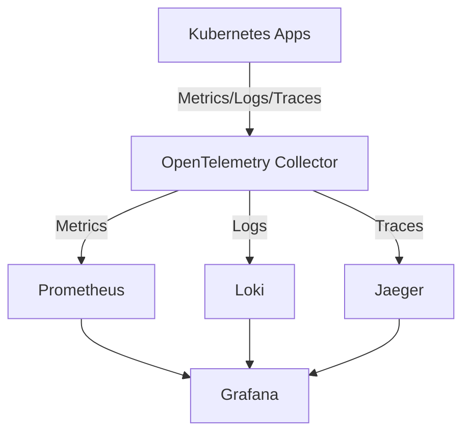

+++
date = '2025-06-04T09:30:56.017769+00:00'
title = 'Engineering observability for Kubernetes: Architectures and real-world strategies'
summary = 'Actionable architectures and real-world strategies for Kubernetes observability with modern open-source tools, secure telemetry design, and SaaS use cases.'
draft = 'false'
model = 'openai:gpt-4.1'
tags = ["observability", "Kubernetes", "cloud monitoring"]
+++

Effective observability is essential for reliable operations in cloud-native
platforms. Legacy monitoring tools rarely provide the context or extensibility
needed for distributed architectures and Kubernetes applications. An
observability framework connects metrics, logs, and traces so you can quickly
understand and fix issues.

## Understanding observability in cloud-native systems

Observability is the ability to infer your system's internal state by collecting
telemetry—such as metrics, logs, and traces—from every service and component.
With microservices and automated infrastructure, design observability strategies
easly, integrating collection, storage, and access directly into your 
architecture.

## The three pillars: Metrics, logs, and traces

- *Metrics* track system health signals like CPU use, memory, and error rates.
  Use metrics to drive forecasts and configure alerts for early warning.
- *Logs* provide detailed event context. Always use structured, queryable
  formats to accelerate root cause analysis.
- *Traces* capture the entire journey of a request through multiple
  microservices, exposing latency and failures at each step in distributed
  systems.

OpenTelemetry (CNCF, 2024) is the unified standard for comprehensive
telemetry collection and supports all three data types.

## A reference observability stack for Kubernetes

This stack captures telemetry from all workloads using standard protocols. The
OpenTelemetry Collector centralizes data, sending metrics to Prometheus, logs to
Loki, and traces to Jaeger. Grafana visualizes and correlates all data sources
on unified dashboards.

## Open-source tool choices and integration

- *Prometheus* gathers metrics with robust querying (PromQL) and alerting features.
- *Loki* indexes logs while associating Kubernetes metadata for precise filtering.
- *Jaeger* presents distributed traces with service graphs and detailed
  timelines.
- *Grafana* unifies the experience, lets you correlate signals, and build
  actionable dashboards.

Each tool is open source and supports standard exporters for integration in any
Kubernetes cluster.

_Example_: Use labels such as `pod` or `namespace` in Loki and Prometheus for fast
per-tenant troubleshooting.

## Scalable and secure observability strategies

- Instrument applications with OpenTelemetry SDKs for languages like Go,
  Python, and Node.js to standardize telemetry.
- Use exporters (Node Exporter, kube-state-metrics) and sidecar containers for
  infrastructure-level data.
- Limit data volume by sampling and filtering within the OpenTelemetry
  Collector and aggregation pipelines.
- Apply labels for multi-tenant or shared infrastructure. Enforce access
  control (RBAC) in Grafana and Prometheus.
- Automate deployment of all stack components with Helm charts or Kubernetes
  manifests to ensure consistency and reproducibility.
- Secure data in transit (TLS) and at rest. Regularly audit retention
  policies. Adhere to least-privilege principle.

_Citation: OpenTelemetry project documentation, CNCF (2024)._

## Real-world SaaS observability example

A SaaS team deployed OpenTelemetry SDKs in Go and Node.js services, routed
traces to the collector, metrics to Prometheus, and logs to Loki. Grafana
presented unified dashboards. During a production latency event, engineers
used Grafana's Explore view to correlate Jaeger traces and Loki logs by request
ID. They traced the slowdown to an upstream API dependency, performed a
rollback, and confirmed recovery—all in under 15 minutes. The unified approach
shortened incident response times and improved post-incident analysis.

## Common pitfalls and avoidance

- Telemetry sprawl creates storage and cost issues. Regularly remove unused
  data sources.
- Siloed data prevents correlating symptoms with root causes. Adopt platforms
  that unify metrics, logs, and traces.
- Logs and traces missing key metadata, like service names or request IDs,
  make debugging slow. Always enrich data at the point of capture.

## Next steps: advancing your observability

Improve your stack by adding synthetic monitoring to simulate user flows and
catch outside-in issues. Integrate cloud cost visibility and anomaly detection
for financial and operational optimization. Share custom dashboards with teams
to encourage continuous learning and accountability.

For additional guidance and up-to-date best practices, refer to the official
OpenTelemetry documentation (https://opentelemetry.io/docs/), CNCF resources,
and community forums.