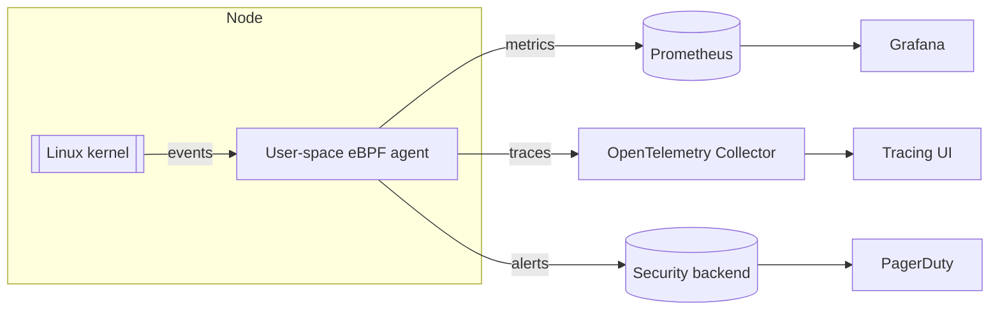

+++
date = '2025-06-12T10:37:50.369683+00:00'
title = 'Harnessing eBPF for Observability and Runtime Security in Kubernetes'
summary = 'eBPF closes the Kubernetes kernel visibility gap and adds real-time runtime security. Learn architecture, deployment, tuning and pitfalls so you can profile, trace and secure clusters in production.'
draft = 'false'
model = 'openai:o3-pro'
tags = ["eBPF", "Kubernetes", "security"]
+++

Modern Kubernetes clusters surface pod-level metrics yet expose little about what happens inside the kernel. Extended Berkeley Packet Filter (eBPF) fills that blind spot by running safe, sandboxed programs in the kernel and streaming structured events to user space. This post shows how to apply eBPF for production-grade observability and runtime security—no patching or reboots required.

## Mind the visibility gap

Containers mask system calls, network paths and context switches. Legacy agents hooked with `ptrace`, iptables or out-of-tree modules, piling on latency and operational risk. eBPF instruments those same kernel paths at run-time, delivering near-zero-copy telemetry with minimal overhead (≈1–3 % CPU in production tests).

## eBPF in 90 seconds

1. Compile a small byte-code program that attaches to a dynamic kernel hook (kprobe, tracepoint, uprobe, cgroup or socket).  
2. The in-kernel verifier enforces safety, bounded loops and memory limits.  
3. On each matching event the program runs and writes data to ring buffers or persistent BPF maps.  
4. A user-space agent reads those buffers and forwards metrics, traces or alerts to Prometheus, OpenTelemetry or your SIEM.

No kernel patches, no out-of-tree modules and no node reboots.

## Observability wins

### Network flow records
Attach probes at the Traffic Control (TC) or XDP layer to export five-tuple connections per namespace. Cilium Hubble enriches flows with pod labels, giving you a live service map—without sidecars or iptables chains.

### Application tracing with zero code changes
Pixie auto-attaches uprobes to Go, Java and Node runtimes, streaming function latency and SQL statements in real time. Continuous flame graphs appear instantly and you never touch application code.

### Always-on CPU profiling
Sampling `sched_switch` and `cpu_clock` tracepoints captures on-CPU stacks at sub-millisecond intervals. Parca and Pyroscope let you keep profiling enabled in production without inflating tail latency.

## Runtime security benefits

### Syscall guardrails
Cilium Tetragon translates policy rules into BPF filters that can block a container opening `/dev/mem` before the syscall completes. Falco offers eBPF-powered alerting for similar events.

### File-integrity events
Tracee-FIM hooks into inode operations via the BPF LSM. Instead of rescanning full volumes it streams changes and validates hashes on the fly.

### Inline network policy
Because eBPF already inspects every packet, it can enforce identity-based ACLs. Cilium replaces sprawling iptables chains with constant-time lookups in the data path.

## Quick example: count `execve` per pod
A 25-line BPF program attached to the `execve` tracepoint increments a per-pod counter in a hash map and emits an alert when it crosses a threshold. Deploy it as a DaemonSet; you’ll spend <1 % CPU per node and touch zero application code.

## Reference architecture

Each node runs a privileged DaemonSet that streams kernel events into your existing observability stack.

## Deployment checklist

1. Linux kernel ≥ 5.10 for CO-RE (Compile Once, Run Everywhere) and BPF LSM.  
2. Ensure `CONFIG_BPF`, `CONFIG_BPF_SYSCALL` and `CONFIG_BPF_LSM` are enabled (most modern distros already do).  
3. Install an agent (Hubble, Pixie, Parca or Tetragon) via its Helm chart, including RBAC and seccomp profiles.  
4. Scope collection with pod annotations or CRDs to avoid buffer floods.  
5. Export results through Prometheus remote-write or the OpenTelemetry protocol.

## Performance tuning tips

• Keep programs small (<10 k instructions); they load faster and are easier to reason about.  
• Monitor `bpf_prog_run_*` and `bpf_ringbuf_dropped` via `bpftool prog stats` to right-size buffers.  
• Even with CO-RE, mismatched kernel headers bite—CI-test new node images with automated eBPF smoke tests.

## Pitfalls and mitigations

| Pitfall | Mitigation |
| --- | --- |
| Kernel upgrade breaks probes | Pin to an LTS kernel; include eBPF smoke tests in CI |
| Collector overwhelmed | Filter or sample events inside the BPF program before user space |
| Privileged DaemonSets worry auditors | Combine with SELinux/AppArmor and document the threat model |
| Verifier rejects complex logic | Split the program or offload heavy work to user space |

## Next steps

Start in staging, baseline CPU and memory cost, then gate production rollout behind a feature flag. Finally, funnel eBPF events into Open Policy Agent to trigger automated remediation.

---
References  
1. Linux kernel docs, “BPF and XDP reference guide,” 2024.  
2. H. Bui et al., *Tetragon: eBPF-based Security Observability*, Cilium, 2023.  
3. Y. Oz & I. Shakury, *Tracee: Runtime Security and FIM with eBPF*, Aqua Security, 2023.
