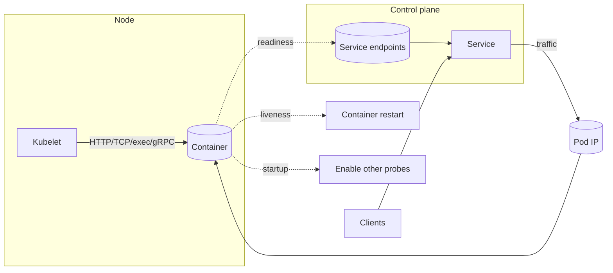

+++
date = '2025-08-11T18:38:56.868399+00:00'
title = 'Kubernetes liveness, readiness, and startup probes: design and tuning'
summary = 'Design and tune Kubernetes liveness, readiness, and startup probes for reliable rollouts, graceful shutdowns, mesh-aware health, and actionable observability that avoids unsafe restarts.'
draft = 'false'
model = 'gpt-5'
tags = ["Kubernetes", "reliability", "SRE"]
+++

Kubernetes gives you three container health signals: liveness, readiness, and
startup. When you tune them well, rollouts become predictable, traffic routes
only to healthy pods, and restarts address real faults without thrashing. This
guide shows how to design, configure, and operate probes so they reflect your
services' true health.

## Understand what each probe does

- Liveness restarts a container that is stuck or dead. After the failure
  threshold is reached, the kubelet kills and restarts the container. During a
  restart the pod is not Ready, so it is removed from Service endpoints.
- Readiness controls whether a pod receives traffic through Services. It never
  restarts the container.
- Startup disables liveness and readiness checks until your app finishes
  starting. After success, regular probes resume.

A probe can use one of four mechanisms: HTTP, TCP, exec, or gRPC. HTTP considers
status 200–399 a success. TCP checks that a connection opens. Exec runs a
command in the container and treats exit code 0 as success. gRPC uses the
standard health checking service and treats SERVING as success (gRPC probes are
stable in Kubernetes 1.27+).

## Choose the right probe for the job

- Use liveness only for unrecoverable app states, such as deadlocks, event loop
  stalls, or fatal configuration. Do not use it to restart on transient
  downstream timeouts.
- Use readiness to express traffic-serving capability. Include dependencies that
  are critical for serving. Exclude optional or degraded paths.
- Use startup for slow boots like JIT warmup, large caches, migrations, or
  dependency handshakes. This prevents liveness from killing a pod before
  initialization completes.

Practical examples:

- Web API: readiness checks DB primary connectivity and a lightweight query;
  liveness checks event loop heartbeat and memory pressure.
- Worker: readiness reflects ability to fetch from the queue; liveness detects
  stuck consumer loops.
- gRPC service: readiness uses gRPC health SERVING; liveness stays local.

## Tune probe parameters that matter

Each probe has timing knobs. Choose values that match your app behavior and
service level objectives. Defaults rarely match production.

- initialDelaySeconds defines when the first check runs. Prefer startup over a
  large initial delay.
- periodSeconds controls check frequency. Readiness should be more frequent than
  liveness.
- timeoutSeconds should exceed realistic tail latency for the endpoint. Account
  for cold CPU and noisy neighbors.
- failureThreshold is the number of consecutive failures to change state. Keep
  liveness small enough to bound stall time, but not so small that transient
  spikes trigger restarts. Readiness can be higher to avoid flapping.
- successThreshold applies to readiness and startup. Liveness is fixed at 1. Use
  it to require stable success before routing traffic again.

Useful defaults to calibrate your thinking: initialDelaySeconds 0,
periodSeconds 10, timeoutSeconds 1, failureThreshold 3, successThreshold 1.

Practical starting points for web services:

- Readiness period 5–10 seconds, timeout 1–3 seconds, failureThreshold 3.
- Liveness period 30–60 seconds, timeout 1–3 seconds, failureThreshold 3.
- Startup budget equal to worst-case boot plus margin.

Adjust with production data and validate under load.

## Design health endpoints that reflect reality

- Keep liveness cheap and local. Do not call external dependencies. Measure
  process health such as event loop responsiveness, thread progress, and memory
  availability.
- Make readiness reflect ability to serve traffic. Check essential dependencies
  like a primary database or a critical cache. Use cached signals to avoid
  extra load on dependencies.
- Return clear, binary signals. Avoid partial status for probes. Expose richer
  status on a separate diagnostics endpoint for humans.
- Isolate probe endpoints from user-traffic code paths. Skip heavy auth,
  tracing, or database work on probe requests.
- Implement a shutdown path. On SIGTERM, flip readiness to false quickly. Drain
  in-flight work, then exit. Set terminationGracePeriodSeconds to cover the
  longest in-flight work.

## Plan for rollouts, scaling, and traffic

- Readiness determines whether a pod is added to Service endpoints. This drives
  rolling updates. Combine with minReadySeconds to require a period of stable
  readiness before a Deployment advances. Align with maxSurge and
  maxUnavailable to bound capacity during updates.
- Liveness affects stability and autoscaling signals. Restarts clear process
  state and can hide real issues. Watch for CrashLoopBackOff patterns.
- Startup protects slow boots during deployments and node restarts. It prevents
  premature liveness failures.
- The Horizontal Pod Autoscaler uses metrics independent of probes. Probes
  change which pods receive traffic, so they indirectly affect observed
  load.
- Use PodDisruptionBudgets so voluntary disruptions do not drop capacity when
  combined with readiness-based rollouts.

## Account for sidecars and service meshes

- Probes are sent by the kubelet on the node to the pod IP. In many meshes,
  iptables rules route this traffic through the sidecar unless excluded or
  rewritten. Ensure your probe path aligns with proxy readiness.
- If you use a mesh, consider probe rewrites or exec probes to avoid mismatches.
  Test this path to avoid sending traffic to pods where the proxy is not ready.
  For Istio, review the probe rewrite feature. For Linkerd, ensure the
  readiness of the proxy is included if needed.
- In multi-container pods, each container can define probes. If a sidecar has a
  readiness probe and it fails, the pod will not be Ready. Decide whether the
  sidecar should gate traffic. Omit a sidecar readiness probe if it must not
  block app readiness, or include it if proxy readiness is required.

## Graceful shutdown and termination

- Kubernetes sends SIGTERM, then waits terminationGracePeriodSeconds before
  SIGKILL. Your app should stop accepting new work, drain in-flight requests,
  and exit within the grace period.
- Use a preStop hook or a signal handler to set readiness to false immediately.
  This removes the pod from Service endpoints. Then complete drains. Be aware
  that a long-running preStop delays SIGTERM.
- Liveness should not trigger during shutdown. Keep liveness conservative and
  allow enough grace time.

## Observability and debugging

Track these signals together:

- Container restarts and last termination reason.
- Readiness transitions for pods behind Services.
- Probe latency distributions and timeouts.
- Node pressure events such as memory or disk pressure.
- Application logs around probe handlers and shutdown.

Create alerts for rising restart rates, frequent readiness flaps, and
persistent probe timeouts. Correlate with deployment events and cluster
changes. Include probe traffic in load and chaos tests.

## Common failure patterns and fixes

- Flapping readiness. The endpoint is too strict or successThreshold is too low.
  Increase successThreshold and stabilize the check.
- Liveness restarts under load. The liveness endpoint is expensive or shares a
  hot path. Make it cheap and separate from heavy work.
- Premature restarts on cold start. Missing startup probe. Add startup with a
  budget that matches worst-case initialization.
- Mesh proxy not ready, traffic blackholes. Probes are misaligned with the
  proxy. Align probes with proxy readiness, use mesh features to rewrite probes,
  or delay app readiness until the proxy is up.
- Dependency outages trigger restarts. Liveness includes external checks. Move
  dependency checks to readiness and implement backoff.
- Timeouts on shared nodes. timeoutSeconds is too low for tail latency. Increase
  timeout using production p99 latency.

## Edge cases and special topics

- gRPC probes. Use standard gRPC health checks so the probe reflects RPC
  serving health instead of just TCP connectivity. Ensure Kubernetes 1.27+.
- TCP probes. Useful for simple readiness signals such as a port being open. It
  says nothing about application logic. Use with care.
- Exec probes. Useful when you need to check local process state or files.
- Jobs and CronJobs. Readiness usually does not apply. Liveness rarely helps for
  short jobs. Prefer clear timeouts and retries in the job runner.
- Long-running workers. Readiness should reflect ability to accept new work from
  a queue. Liveness should detect fatal loops. Add backpressure awareness.
- Multi-tenant platforms. Standardize probe contracts. Define shared defaults
  and budgets. Provide libraries for consistent behavior.

## Architecture at a glance

## Practical checklist

- Separate endpoints for liveness and readiness. Keep liveness local.
- Add startup for slow initialization.
- Tune timeouts and thresholds with production latency data.
- Make readiness go false on shutdown. Use a preStop hook or signal handling.
- Align probes with sidecars if you use a mesh.
- Use PodDisruptionBudgets and minReadySeconds during rollouts.
- Observe and alert on restarts and readiness flaps.
- Include probe traffic in capacity tests.

## References

- Kubernetes probes, concepts and configuration:
  https://kubernetes.io/docs/tasks/configure-pod-container/configure-liveness-readiness-startup-probes/
- Pod lifecycle and termination:
  https://kubernetes.io/docs/concepts/workloads/pods/pod-lifecycle/#pod-termination
- Deployments and minReadySeconds:
  https://kubernetes.io/docs/concepts/workloads/controllers/deployment/#progress-deadline-seconds
- Readiness gates for custom pod conditions:
  https://kubernetes.io/docs/concepts/workloads/pods/pod-readiness-gate/
- gRPC health checking protocol:
  https://github.com/grpc/grpc/blob/master/doc/health-checking.md
- Istio probe rewrite:
  https://istio.io/latest/docs/ops/configuration/traffic-management/probe-rewrite/

## Summary and next steps

Done well, probes express intent. Liveness restarts on true deadlocks.
Readiness routes traffic only to pods ready to serve. Startup protects slow
boots. Add probe behavior to your test plans, validate under load, and
standardize defaults across teams.