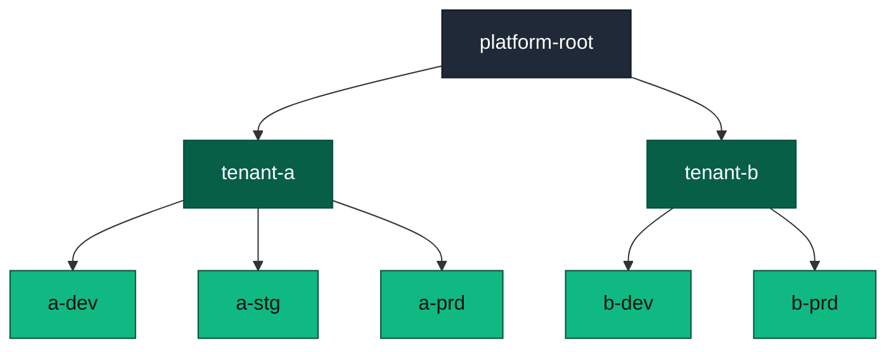

+++
date = '2025-08-11T18:14:36.182612+00:00'
title = 'Kubernetes multi-tenancy done right: namespaces, HNC, and NetworkPolicy'
summary = 'A field-tested Kubernetes multi-tenancy blueprint using namespaces, HNC, and NetworkPolicy, with guardrails, corrections, and references. Includes practical patterns, pitfalls, and proven add-ons for security, scale, and autonomy.'
draft = 'false'
model = 'gpt-5'
tags = ["Kubernetes", "Multi-tenancy", "Security"]
+++

You want teams to ship fast without stepping on each other. You also want
containment when something fails. Kubernetes provides the building blocks for
safe multi-tenancy in a single cluster.

Use namespaces for boundaries, the Hierarchical Namespace Controller (HNC) for
scalable organization and policy propagation, and Kubernetes NetworkPolicy for
traffic isolation. Add role-based access control (RBAC), Pod Security Admission
(PSA), resource quotas, and GitOps to make it durable.

References:
- Namespaces: https://kubernetes.io/docs/concepts/overview/working-with-objects/namespaces/
- NetworkPolicy: https://kubernetes.io/docs/concepts/services-networking/network-policies/
- PSA: https://kubernetes.io/docs/concepts/security/pod-security-admission/
- Pod Security Standards: https://kubernetes.io/docs/concepts/security/pod-security-standards/
- RBAC: https://kubernetes.io/docs/reference/access-authn-authz/rbac/
- HNC: https://github.com/kubernetes-sigs/hierarchical-namespaces
- SIG multi-tenancy: https://sigs.k8s.io/multi-tenancy

## What good Kubernetes multi-tenancy means

- Isolation. Tenants do not interfere through traffic, resources, or
  permissions.
- Fairness. Workloads get predictable CPU, memory, and storage.
- Autonomy. Teams manage day to day without cluster-admin access.
- Guardrails. Security and platform standards apply everywhere by default.
- Auditability. Everything is declarative and reviewable.

If your legal, compliance, or threat model needs strict hardware or
control-plane isolation, use separate clusters. Otherwise, in-cluster
multi-tenancy is efficient and safe when designed well.

## When one cluster is enough, when many are better

Use one cluster per environment when tenants share risk tolerance, network
zones, and lifecycle. Split into multiple clusters when you need different
Kubernetes versions, admission controls, strict data boundaries, or very
different SLOs. Prefer fewer clusters with strong in-cluster isolation.

## Namespaces as the tenancy contract

Namespaces are the smallest practical boundary for teams. Treat them as a
contract and a stable API for tenancy.

- Identity and ownership. Standardize labels like tenant, environment, and
  cost-center. Drive RBAC, quotas, and policies from these labels.
- RBAC. Grant tenant admins admin rights within their namespace tree only.
  Avoid cluster-admin for daily work. Use least-privilege service accounts.
- Resource fairness. Apply LimitRanges for pod defaults and ResourceQuotas for
  ceilings. Include quotas for object counts and PersistentVolumeClaims.
- Pod security. Enforce PSA at the namespace level. Use restricted for tenant
  namespaces and reserve privileged only for platform namespaces.

Quick example: label namespaces with tenant=acme and env=dev, stg, prd. Bind
Roles to those labels so access and quotas follow the tenant.

## HNC for namespace hierarchy and policy propagation

The Hierarchical Namespace Controller creates a parent-child structure of
namespaces and propagates selected objects down the tree. This reduces
copy-paste and drift at scale and enables clear ownership across a namespace
hierarchy.

What to propagate from a tenant root namespace into children:
- Labels and annotations for identity and policy selection.
- RBAC Role and RoleBinding for tenant-admin and read-only roles. Propagate
  RoleBindings that bind to ClusterRoles scoped to the namespace, not
  cluster-scoped permissions.
- NetworkPolicy defaults such as ingress and egress deny rules.
- LimitRange baselines and, if appropriate, ResourceQuota templates with
  child-specific overrides. Prefer HierarchicalResourceQuota for aggregate
  caps across a tenant tree.
- PSA labels so the security posture stays consistent.
- Default ConfigMaps or Secrets for read-only common config. Prefer an
  external secret store to avoid secret copying.

Operational patterns that work:
- Create a tenant root namespace per team or business unit, then child
  namespaces per environment or workload type.
- Delegate admin at the tenant root. Teams create additional children using
  HNC subnamespace anchors without platform involvement.
- Keep platform-owned namespaces outside tenant trees to prevent accidental
  propagation.

Pitfalls and how to avoid them:
- Conflicts. If a child defines an object with the same name, HNC does not
  overwrite it. Monitor and reconcile drift.
- Deletion cascades. Deleting a parent can orphan or delete children. Require
  approvals and backups for destructive changes.
- Privilege escalation. Never propagate cluster-scoped permissions. Restrict
  propagation to namespace-scoped Roles and RoleBindings.

References:
- HNC user guide and HierarchicalResourceQuota: https://github.com/kubernetes-sigs/hierarchical-namespaces/tree/master/docs

## NetworkPolicy that actually isolates traffic

Kubernetes NetworkPolicy is the isolation switch. Without it, pods can talk
freely. Enforce it from day one.

Model:
- Default deny for ingress and egress in every tenant child namespace.
- Permit intra-tenant traffic using namespace labels, not hard-coded names.
- Allow minimal egress for DNS, time sync, and required external services.
- Isolate admin and control-plane components in platform namespaces.

Container Network Interface (CNI) support matters. Verify that your CNI
enforces NetworkPolicy for ingress and egress, named ports, and IPBlocks.
Examples:
- GKE supports NetworkPolicy with Dataplane V2 or Calico.
- AKS supports NetworkPolicy with Azure network policy, Calico, or Azure CNI
  powered by Cilium.
- EKS needs a network policy provider such as Calico or Cilium. Security
  groups for pods are an alternative for L3 isolation.

References:
- GKE: https://cloud.google.com/kubernetes-engine/docs/how-to/network-policy
- AKS: https://learn.microsoft.com/azure/aks/use-network-policies
- AKS Cilium dataplane: https://learn.microsoft.com/azure/aks/azure-cni-powered-by-cilium
- EKS and Calico: https://docs.aws.amazon.com/eks/latest/userguide/calico.html
- EKS security groups for pods: https://docs.aws.amazon.com/eks/latest/userguide/security-groups-for-pods.html

Handling DNS and egress:
- DNS. Keep CoreDNS reachable while blocking other cross-tenant traffic.
  Select kube-system explicitly with a namespace selector and labels. If you
  run NodeLocal DNSCache, target that DaemonSet instead.
- Egress allowlists. If FQDN rules are required, use a CNI with DNS-aware
  policies or route through an egress gateway or proxy with IP allowlists.
- Ingress and gateways. Ingress cannot reference Services across namespaces.
  If you use Gateway API for shared load balancers, control cross-namespace
  routing with ReferenceGrant and namespace scoping.

Test continuously. Add connectivity tests to CI to validate that blocked paths
stay blocked and allowed paths stay allowed. Test intra-namespace,
inter-tenant, and tenant-to-platform flows.

References:
- Gateway API: https://gateway-api.sigs.k8s.io/
- ReferenceGrant: https://gateway-api.sigs.k8s.io/guides/references/referencegrant/

## Reference structure with HNC

From platform-root to tenant roots, propagate global labels, common policies,
and platform-owned RBAC. From tenant roots to children, propagate tenant RBAC,
quotas, and default network policies.

## Pod security, policy, and guardrails

Use PSA to enforce runtime controls across namespaces. Aim for restricted in
all tenant namespaces. Allow exceptions only in dedicated namespaces.

Complement PSA with policy engines:
- Kyverno or Gatekeeper for image provenance, hostPath bans, required labels,
  and runtime class restrictions.
- Built-in ValidatingAdmissionPolicy for guardrails like blocking host
  networking or preventing cross-namespace secret mounts.
- Enable the kubelet seccompDefault so pods use the runtime/default profile by
  default. Enforce readOnlyRootFilesystem and disallow privilege escalation.
- Consider RuntimeClass with gVisor or Kata Containers for stronger workload
  isolation in sensitive namespaces.

References:
- Kyverno: https://kyverno.io/
- Gatekeeper: https://github.com/open-policy-agent/gatekeeper
- ValidatingAdmissionPolicy: https://kubernetes.io/docs/reference/access-authn-authz/validating-admission-policy/
- Seccomp default: https://kubernetes.io/docs/tutorials/security/seccomp/#enable-the-seccomp-profile-runtime-default
- RuntimeClass: https://kubernetes.io/docs/concepts/containers/runtime-class/
- gVisor: https://gvisor.dev/
- Kata Containers: https://katacontainers.io/

## Resource isolation and fairness

Quota strategy:
- Baseline CPU, memory, and PVC storage per tenant child. Use PriorityClasses
  to define burst pools and protect critical workloads.
- Object-count quotas to protect the control plane from exhaustion.
- StorageClass-specific quotas to protect premium classes.
- Use HierarchicalResourceQuota to cap aggregate tenant usage across all
  children under a tenant root.

Scheduling and nodes:
- Use taints and tolerations to steer noisy or privileged workloads to
  dedicated node pools.
- Keep tenant workloads off system nodes.
- Use PodPriority to protect SLO-critical platform components.

Control plane fairness:
- Configure API Priority and Fairness so a single tenant cannot starve the API
  server during surges.

Cost and visibility:
- Label everything with tenant and environment. Feed labels into cost analysis
  and reports.
- Share savings with teams when they rightsize.

References:
- API Priority and Fairness: https://kubernetes.io/docs/concepts/cluster-administration/flow-control/

## GitOps for safety and speed

Manage the entire tenancy model in Git. Store namespace trees, HNC configs,
RBAC, quotas, PSA labels, and NetworkPolicy templates. Use a separate repo for
platform-wide defaults and one per tenant for overrides. Require pull requests
for changes with automated policy and connectivity tests.

Tools:
- Flux or Argo CD for reconciliation and drift detection.
- Conftest or policy testing frameworks for static checks.
- Integration tests that deploy synthetic services and probe allowed and
  denied paths.

## Observability and tenancy

- Metrics. Scope collection by namespace. Provide shared Prometheus with
  per-tenant dashboards or a multi-tenant backend such as Cortex or Thanos.
- Logs. Route by namespace labels into separate streams and retention
  policies. Use backends with tenant-aware auth like Loki or Elastic.
- Traces. Propagate tenant context through headers. Isolate access in the APM
  backend.
- Alerts. Give tenants ownership of their alerts. The platform owns SLOs for
  shared services.

## Common failure modes and fixes

- No default deny. Propagate deny-all policies first, then add allow rules.
- Overly broad selectors. Rely on labels, not wildcard IPBlocks or empty
  selectors.
- Label drift. Lock labels with policy and reconcile drift via GitOps.
- Cross-namespace references. Restrict them with admission policies. Review
  Gateway API ReferenceGrants and volume claims.
- HNC conflicts. Watch for propagated-object conflicts and resolve with
  consistent naming and override policy.
- Service mesh surprises. Mesh policies do not replace NetworkPolicy. Keep L3
  and L4 isolation even with a mesh.
- Service account tokens. Set automount to false by default and use bounded
  tokens.

References:
- Service accounts: https://kubernetes.io/docs/reference/access-authn-authz/service-accounts-admin/

## Results you should expect

- Reduced lateral movement and blast radius within the cluster.
- Predictable resource usage and fewer noisy-neighbor incidents.
- Faster tenant onboarding through HNC templates and GitOps.
- Lower operational toil because security and platform defaults propagate.

## Next steps

- Pilot HNC in a non-production cluster. Model two real tenants and validate
  propagation, RBAC, and isolation.
- Turn on default deny ingress and egress for a small set of namespaces, then
  iterate on allowlists.
- Enforce PSA restricted across tenants and add policy tests to CI.
- Configure API Priority and Fairness for control-plane resilience.
- Measure outcomes. Track time to onboard a tenant, policy drift, and
  cross-tenant incident rate.
