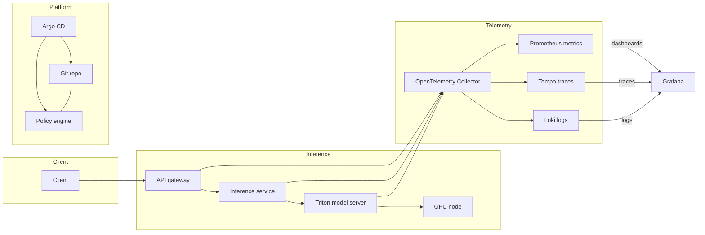

+++
date = '2025-08-11T18:53:03.816031+00:00'
title = 'Observability-Driven Platform Engineering for Real-Time AI Workloads'
summary = 'ODPE reframes telemetry as a product to deliver end-to-end visibility for real-time AI workloads, with architecture, instrumentation, pipelines, and GitOps-driven automation.'
draft = 'false'
model = 'gpt-5-nano'
tags = ["observability", "platform engineering", "ai"]
+++

Real-time AI workloads demand full visibility across the stack. You need visibility that travels with the platform, not telemetry added after the fact. ODPE treats telemetry as a product and binds it to the control plane and the inference layer. The goal is to reduce tail latency, improve reliability, and control costs in a dynamic environment.

## Problem and proposed solution

In practice, teams ship AI services without end-to-end visibility into latency, data quality, and resource contention. Real-time scoring, streaming inference, and data drift create hidden failure modes that surface only when a customer experiences degradation. ODPE reframes observability as a core platform capability that you design, operate, and improve with the same rigor as your serving and data planes.

The core idea is simple: instrument, collect, and act on signals across four layers—the data plane, the observability pipeline, the analysis layer, and the platform control plane. When signals are treated as products, you can evolve SLOs, automate remediation, and reason about cost and risk with the same discipline you apply to models and deployments.

## Architecture overview

ODPE for real-time AI workloads sits at the intersection of four layers:

- data plane: the inference path and data ingest that generate telemetry
- observability pipeline: the collection, enrichment, and routing of signals
- analysis layer: dashboards, alerts, and automated decision making
- platform control plane: policy, governance, and GitOps-driven automation

Real-time AI workloads typically include model hosting, data ingestion, and serving orchestration. The telemetry you collect should enable end-to-end visibility from client request to final inference result and back again for retries, data drift, and budget checks.

## Key signals and instrumentation

Focus on signals that drive user impact and operational efficiency. Latency percentiles (p95, p99) for each inference path, throughput, queue depths, and GPU utilization reveal tail behavior. Data quality signals such as drift, missing features, and schema changes help you preempt degraded accuracy. System health metrics (CPU, memory, network, disk I/O) and resource contention seal the picture. End-to-end tracing helps you diagnose where tail latency originates, while structured logs enable post-mortem and automation.

Instrument critical paths in your serving and data pipelines. Use a mix of application-level instrumentation, auto-instrumentation, and request-scoped metadata. Attach a unique request identifier and data identifier to enable cross-service correlation. Enrich traces with metadata like model version, deployment slot, feature store key, and GPU node identifier.

OpenTelemetry provides a canonical, vendor-neutral approach to instrumenting and exporting traces, metrics, and logs. See the project for guidance and practices that match most cloud-native stacks: https://opentelemetry.io/

## Telemetry pipeline and storage options

A practical telemetry stack separates signal generation from analysis. A typical setup uses:

- an OpenTelemetry Collector to ingest and transform sources near the point of origin
- Prometheus for high-resolution metrics
- Tempo for scalable distributed traces
- Loki for indexed logs that correlate with traces

This combination supports both operator dashboards and automated response loops. Grafana serves as the unifying surface for metrics, traces, and logs, with queries that span AI inference, data ingestion, and platform health.

## Real-time AI specifics and design patterns

Real-time AI workloads demand low-latency visibility and rapid, safe responses to signal breaches. Consider the following design patterns:

- model-aware telemetry: export model version, warmup status, and hardware affinity alongside latency metrics. This enables drift attribution and quick rollbacks.
- data-path observability: collect input data characteristics (shape, missingness, distribution) so that data drift aligns with model drift signals.
- correlation champions: enforce request-scoped IDs that traverse the client, API gateway, inference service, and model server for reliable end-to-end traces.
- tail-first routing: implement routing policies that favor lower-latency paths when p99 latency breaches occur. This helps protect user experience during contention or model warmup.

In practice you often pair a GPU-aware autoscaler with a GitOps-driven deployment workflow. You want to scale not just on request rate but on latency and data quality signals, while keeping deployments auditable and reversible.

## Implementation approach

This section outlines a pragmatic sequence you can adapt to your stack. It avoids vendor lock-in and keeps operations aligned with real user impact.

## Instrumentation plan

Start with instrumentation in the critical path: inference endpoints, data ingesters, and any streaming components. Attach identifiers for model version and data version, and enrich traces with these tags. Adopt OpenTelemetry SDKs in your language of choice and export signals to backends with minimal overhead.

## Telemetry pipeline and backends

Configure an OpenTelemetry Collector to receive data from services, enrich it where needed, and export signals to backends. Metrics land in Prometheus, traces in Tempo, and logs in Loki. Dashboards should slice signals by model, version, region, and GPU type to surface hotspots quickly.

## Automation and governance

Define alerting rules around SLO breaches and data-quality violations. Use GitOps to encode observability configurations and remediation policies. Reconcile desired vs. actual state with tools such as Argo CD or Flux, ensuring that all changes are tested, auditable, and reversible.

## Security and cost considerations

Secure telemetry sources with strict access controls, encrypted transport, and regular secret rotation. Apply least privilege to dashboards and collection endpoints. Optimize cost by tuning GPU node pools, respecting co-scheduling and cluster-autoscaling to avoid idle capacity.

## Validating with real-user workloads

Validate with traffic that mirrors production load. Monitor latency distributions, data drift signals, and resource contention. Use the results to tune autoscaling, caching strategies, and model versions. Treat validation as a continuous loop that informs capacity planning and feature flags.

## Real-world example

A media platform runs a real-time image scoring service for content moderation. Each frame passes through an AI model hosted on a Triton server with GPU acceleration. Requests are routed through a gateway that attaches a unique trace and data ID. Telemetry flows to the OpenTelemetry Collector, exports metrics to Prometheus, traces to Tempo, and logs to Loki. Grafana dashboards expose tail latency and GPU utilization by model version. If latency spikes, the platform scales inference pods and rotates model versions to mitigate drift. The GitOps pipeline keeps observability configuration, models, and deployment manifests auditable and reproducible.

Architecture diagram: real-time ODPE

Harnessing the diagram helps you communicate where signals originate and how remediation flows reinforce platform safety. This is the core of ODPE: you ship instruments and policies together, then let the data drive the decisions.

## Pitfalls and mitigations

Avoid over-instrumentation that adds noise or cost. Keep SLOs realistic and actionable, focusing on user impact rather than technical vanity metrics. Ensure secure access to telemetry by enforcing encryption, secret rotation, and least-privilege policies. Finally, validate changes through GitOps pipelines to prevent drift and surprise deployments.

## Outcomes and next steps

With ODPE, your teams gain end-to-end visibility into latency, data quality, and resource contention. You detect drift earlier, remediate proactively, and maintain governance through auditable deployments. The approach also helps you optimize costs by aligning autoscaling to latency and data-quality signals.

Continuing work includes refining SLO definitions, expanding instrumentation to new model families, and maturing the automation layer with self-healing hooks and canary controls. The next steps are to broaden telemetry coverage and operationalize quality gates for data and model changes.

## References

- OpenTelemetry: https://opentelemetry.io/
- Prometheus: https://prometheus.io/
- Tempo: https://grafana.com/oss/tempo
- Loki: https://grafana.com/oss/loki
- Grafana: https://grafana.com/
- Argo CD: https://argo-cd.readthedocs.io/
- Flux: https://fluxcd.io/
- Kubernetes: https://kubernetes.io/
- KEDA: https://keda.sh/
- NVIDIA Triton Inference Server: https://developer.nvidia.com/nvidia-triton-inference-server
- NVIDIA data science tools: https://developer.nvidia.com/
