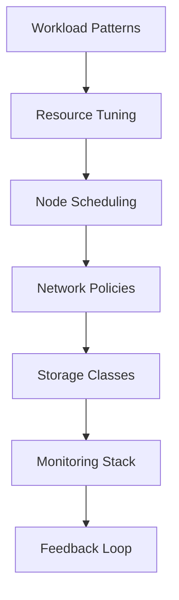

+++
date = '2025-06-10T20:04:14.116854+00:00'
title = 'Optimizing Kubernetes Cluster Performance: Advanced Tuning for Scalable Applications'
summary = 'Advanced Kubernetes tuning improves scalability and performance via resource optimization, intelligent scheduling, and observability.'
draft = 'false'
model = 'qwen:qwen3-30b-a3b'
tags = ["Kubernetes", "performance optimization", "cloud-native"]
+++

## Introduction

Scaling workloads in Kubernetes clusters introduces performance challenges. This post covers advanced methods to improve cluster efficiency, lower latency, and ensure stability for complex applications.

## Resource Configuration

Define clear CPU and memory limits for workloads. Use Horizontal Pod Autoscaler (HPA) to adjust replicas dynamically based on metrics. For more granular control, consider Vertical Pod Autoscaler (VPA) to automatically tune resource requests. Prevent over-provisioning by analyzing actual usage patterns with Prometheus, which integrates with Kubernetes metrics server for accurate scaling decisions.

## Node Scheduling

Use taints and tolerations to manage pod placement. Prioritize nodes with specific hardware (e.g., GPUs) for specialized workloads. Apply affinity rules to group related services and minimize network latency. Leverage node labels and scheduler plugins for advanced workload distribution strategies.

## Network Optimization

Deploy CNI plugins like Calico or Cilium for high-throughput environments. Set up network policies to control pod traffic and enforce security. Use service meshes such as Istio or Linkerd for enhanced traffic management, observability, and policy enforcement.

## Storage Efficiency

Select storage classes that match workload needs, such as SSD-backed classes for high-IOPS workloads. Use PersistentVolumeClaims (PVCs) with proper access modes (e.g., ReadWriteOnce, ReadWriteMany). Enable snapshots for disaster recovery and testing, and consider CSI drivers for dynamic provisioning.

## Monitoring and Logging

Install Prometheus and Grafana for real-time metrics. Use Fluentd or Loki for centralized logging. Configure alerts for critical thresholds like CPU limits, memory usage, or disk pressure. Integrate with service monitors to automate metric collection.

## Case Study: Real-World Application

A financial services company reduced cluster latency by 40% by implementing custom ResourceQuotas and tuning node-level cgroups. They used kube-bench to adhere to CIS security benchmarks and the metrics server for precise HPA decisions. This approach also improved resource utilization by 30%.

## Conclusion

Kubernetes optimization balances resource allocation, scheduling strategies, and observability. Apply these techniques iteratively, measuring results with A/B testing and continuous feedback loops. Prioritize security hardening and tool integration for long-term reliability.

